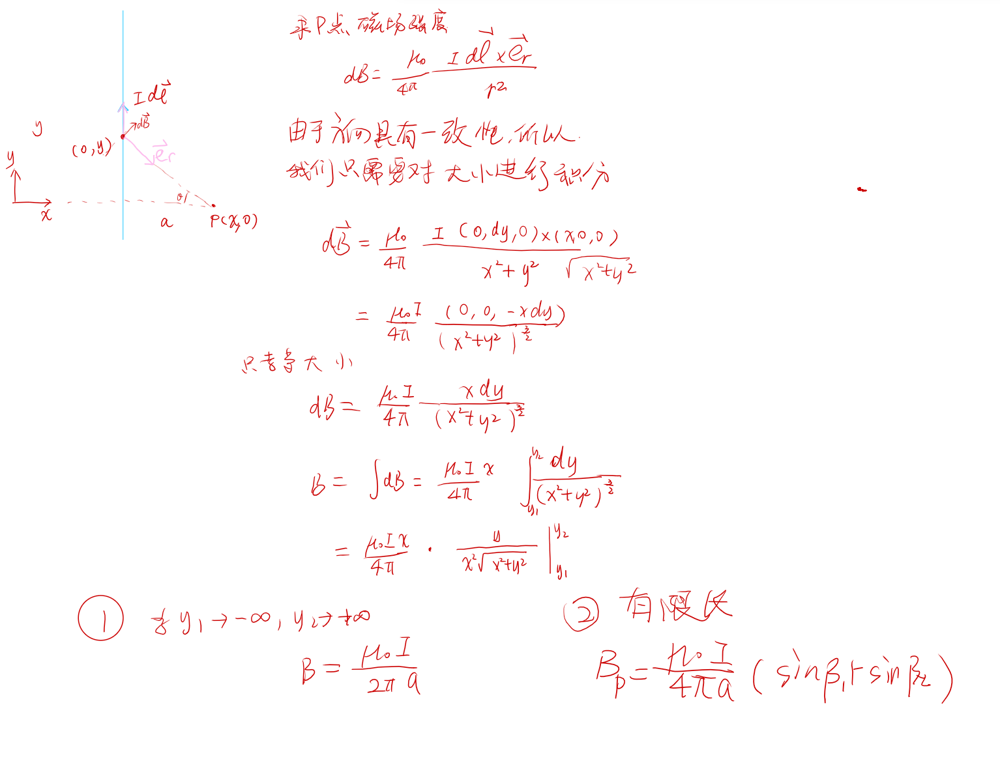
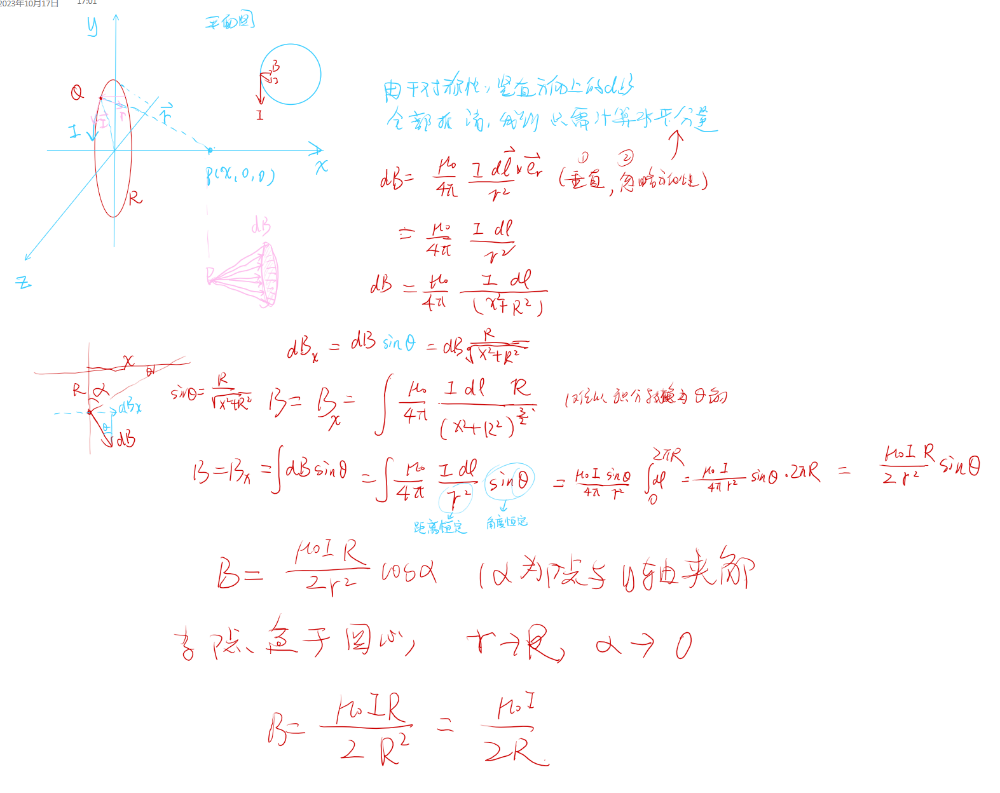
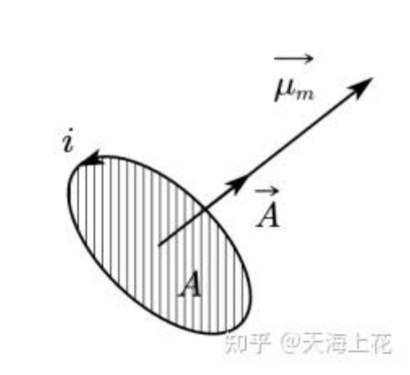

# 毕奥-萨伐尔定律
<!-- @import "[TOC]" {cmd="toc" depthFrom=1 depthTo=6 orderedList=false} -->

<!-- code_chunk_output -->

- [毕奥-萨伐尔定律](#毕奥-萨伐尔定律)
  - [1 毕奥-萨伐尔定律](#1-毕奥-萨伐尔定律)
  - [2 毕萨定律的应用](#2-毕萨定律的应用)
    - [2.1 长直导线的磁场](#21-长直导线的磁场)
    - [2.2 圆行载流导线的磁场](#22-圆行载流导线的磁场)
  - [3 磁偶极矩](#3-磁偶极矩)

<!-- /code_chunk_output -->

---
>毕萨定理需要注意两个问题
```tex
    1. 方向性
    2. 大小性
```


## 1 毕奥-萨伐尔定律

$$d\vec{B} = \frac{\mu_0}{4\pi
}\frac{Id\vec{l}\times \vec{r}}{r^3} = \frac{\mu_0}{4\pi}\frac{Id\vec{l}\times\vec{e_r}}{r^2}$$

## 2 毕萨定律的应用

### 2.1 长直导线的磁场


因此我们记住公式：

$$B_P = \frac{\mu_0I}{4\pi a}(\sin\beta_1+\sin \beta_2)$$

其中，$a$是P点与导线的举例，$\sin\beta_1,\sin\beta_2$是P点与导线两端点的连线和垂线的夹角。
值得注意的是$\sin\beta_1,\sin\beta_2$正负性问题。当夹角越过中垂线应该加上负号。
**我们甚至可以推出导线延长线上的磁场为0，矢量叉乘为0**
### 2.2 圆行载流导线的磁场


所以我们得到公式

$$B = \frac{\mu_0IR}{2r^2}\cos\alpha$$
其中：$r$是$P$离圆心的距离，$\alpha$是$P$点与圆周连线和$y$轴形成的角度。


## 3 磁偶极矩  

$$\vec{m} = IS\vec{e_n}$$
当S很小或者距离很远的时候才可以将圆电流当成磁偶极子