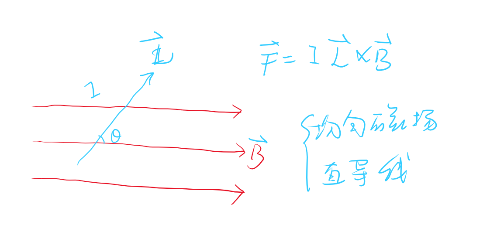
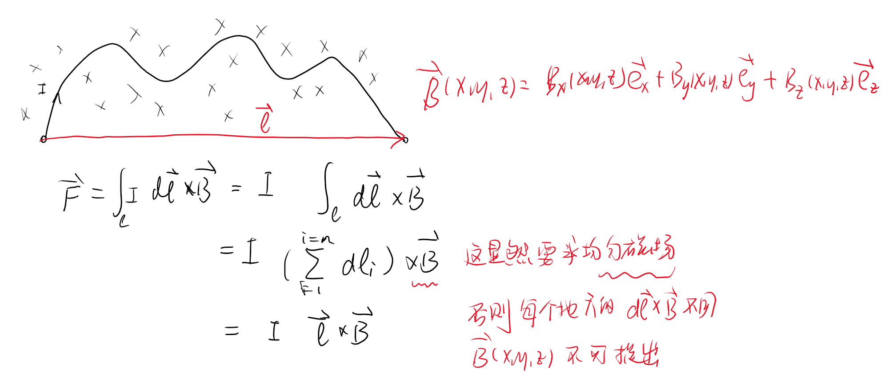
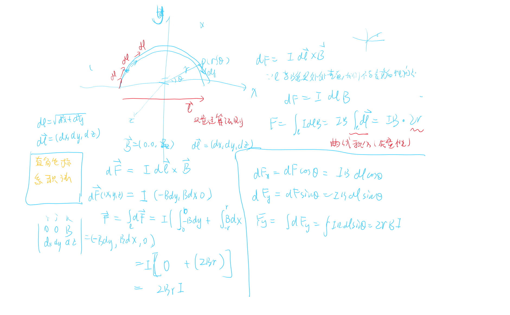
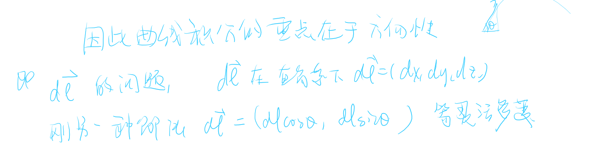

# 载流导线再磁场中受的力 

<!-- @import "[TOC]" {cmd="toc" depthFrom=1 depthTo=6 orderedList=false} -->

<!-- code_chunk_output -->

- [载流导线再磁场中受的力](#载流导线再磁场中受的力)
  - [1 安培定律](#1-安培定律)
    - [均匀磁场的有效长度](#均匀磁场的有效长度)

<!-- /code_chunk_output -->

---

## 1 安培定律 

>

当我们面对非均匀磁场，非直导线的时候，这显然是一个变化的量，以至于不能直接使用乘积求解

面对这种“变化”问题，我们将模型微分，在极小的微分量中，我们近似认为他们是不变的。然后再将每个地方的微分量求和也就是“积分问题”。

一小段微小直线再该点处受到的安培力
$$d\vec{F} = Id\vec{l}\times\vec{B}$$

所以整个直线受到的力显然是一个矢量积分问题

$$\vec{F} = \int_ld\vec{F}=\int_l Id\vec{l}\times\vec{B}$$

$$\begin{cases}
    F_x = \int dF_x \\
    F_y = \int dF_y \\
    F_z = \int dF_z
\end{cases}$$

### 均匀磁场的有效长度

$$\vec{F} = \int_l I d\vec{l}\times\vec{B}$$

例题验证
>

