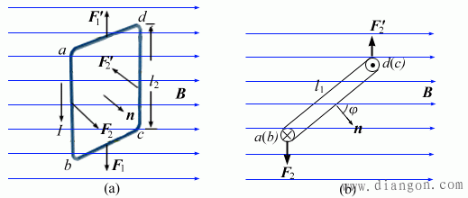
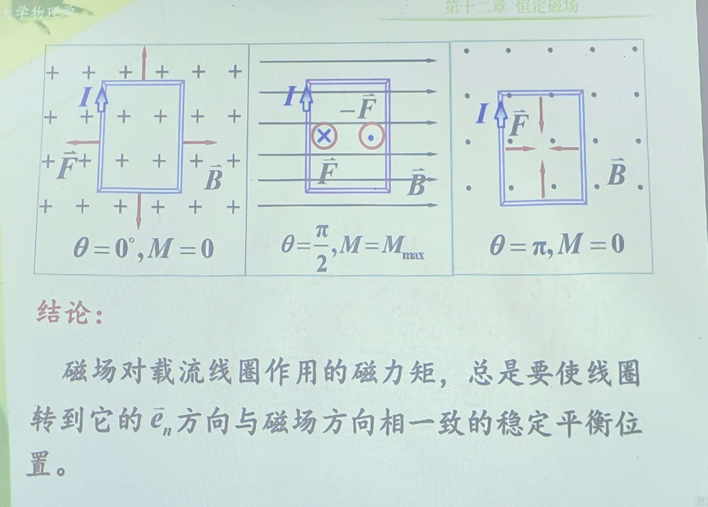

# 磁场对载流线圈的作用  

<!-- @import "[TOC]" {cmd="toc" depthFrom=1 depthTo=6 orderedList=false} -->

<!-- code_chunk_output -->

- [磁场对载流线圈的作用](#磁场对载流线圈的作用)
  - [1 *均匀磁场*对载流线圈的作用](#1-均匀磁场对载流线圈的作用)

<!-- /code_chunk_output -->

## 1 *均匀磁场*对载流线圈的作用

$F_1,F_2$始终为纵向

我们计算力矩

力偶 ：$F_1=F_2 = Il_2B$
力矩 ：$M = F_1\cdot d=IBl_1l_2\sin\theta = ISB\sin\theta$

磁力矩$\vec{M}$,磁矩$\vec{m}$
$$\vec{M} = \vec{m}\times\vec{B}$$

==该公式的使用条件是平面载流线圈==
有力矩就会旋转。没有力矩会进入平衡。

稳定平衡，非稳定平衡
受到外界扰动是否能够回到平衡状态。