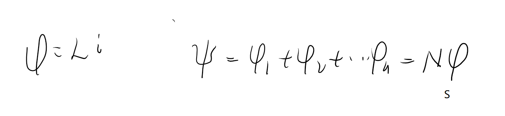
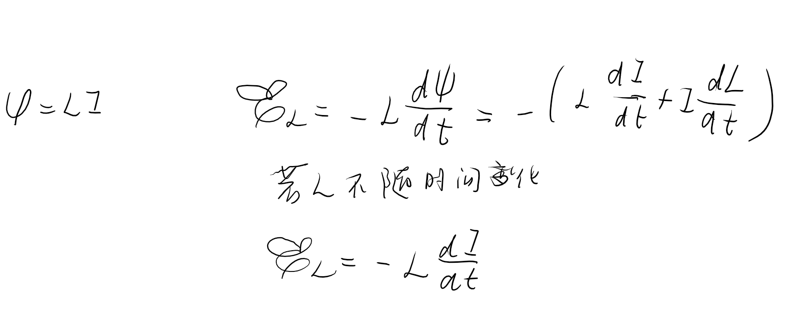
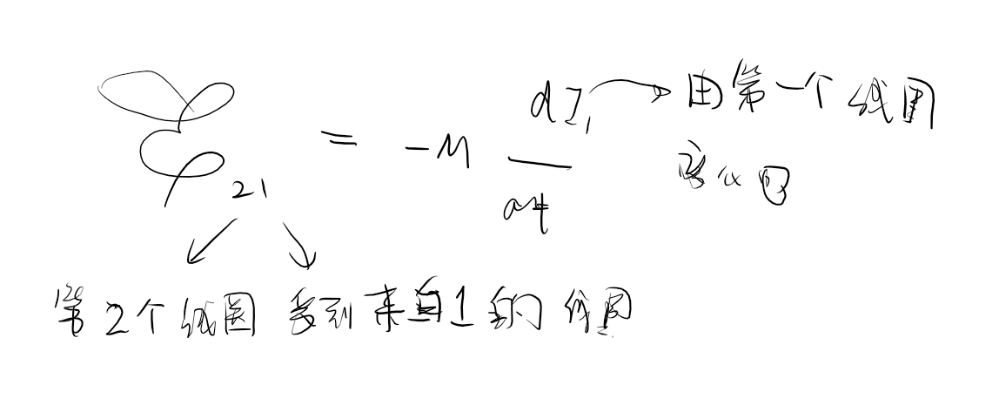
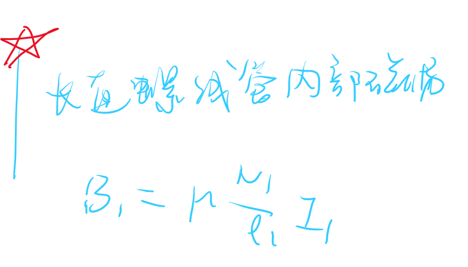
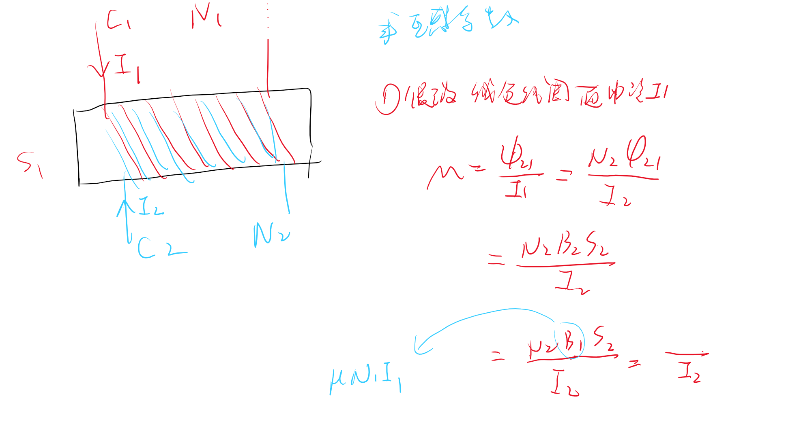

# 1 自感电动势

由于**回路**自身电流的变化而引起的感应电动势。

磁通量应和电流成正比  
$$\varPhi = LI$$
L是自感系数 

*自感系数和回路大小，几何形状，周围介质的磁导率有关*

- 计算自感系数L步骤  
  - 假定回路中电流I
  - 通过磁链$\Psi = N\varPhi$,$\varPhi = BS$
  - 利用公式$L = \frac{\Psi}{I}$

对于规则的电路我们可以使用理论计算。

# 2 互感电动势

**这显然需要有两个回路**

互感电动势

- 步骤 
  - 在其中的一个**回路**中通电流$I$
  - 计算另一个回路的磁通量&磁链$\varPsi = N\varPhi$
  - 计算互感系数$M = \frac{\Psi}{I}$

只与本身的形状有关,同围的磁介质相对位置与电流无关无关

