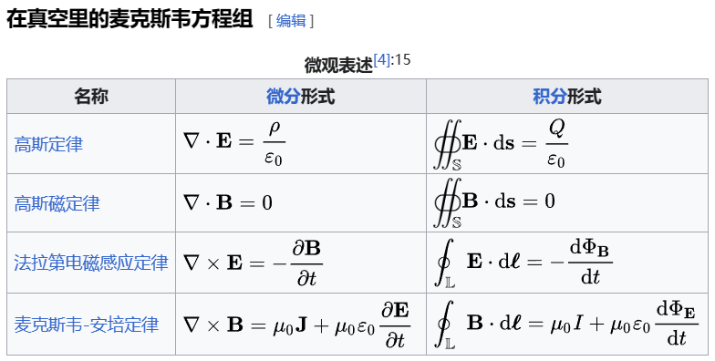
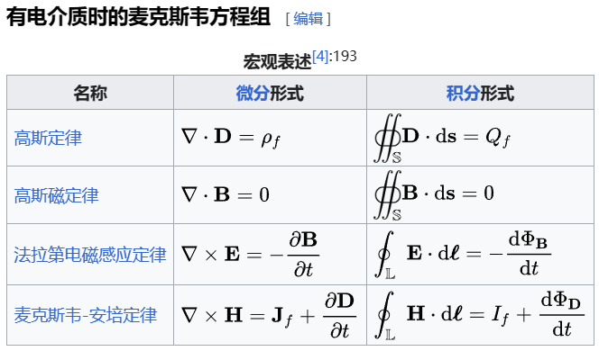

## 1 位移电流  

我们原本学的都是传导电流
$$I_c$$
现在引入位移电流  
$$I_d$$他不是由运动电荷形成的，它是由变化的电场产生的电流。

$$I_d = \frac{d\varPhi_D}{dt}$$

电位移矢量的通量
$$\int \vec{D}d\vec{S} = \varPhi_D$$

$$I_d = \frac{d\varPhi_D}{dt}$$

**变化的磁场激发电场，变化的电场产生磁场，以有限的速度交替激发。他预测了电磁波的存在。**

## Maxwell 方程组

- maxwell的描述
  - 普通电场是无旋场
  - 磁场是无散场
  - 变化的磁场激发有旋电场
  - 变化的电场激发有旋磁场

>https://zh.wikipedia.org/wiki/%E9%A6%AC%E5%85%8B%E5%A3%AB%E5%A8%81%E6%96%B9%E7%A8%8B%E7%B5%84#%E9%80%B2%E9%9A%8E%E8%A1%A8%E8%BF%B0
