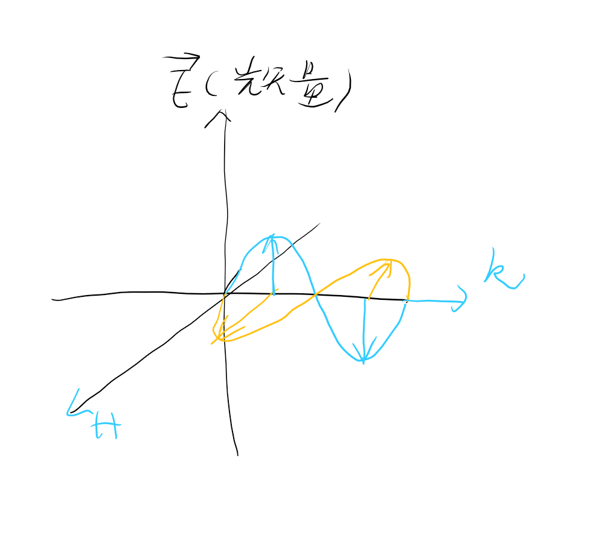
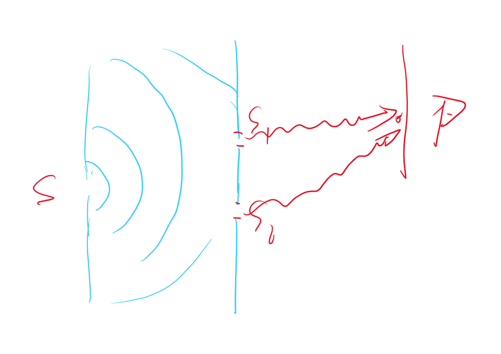
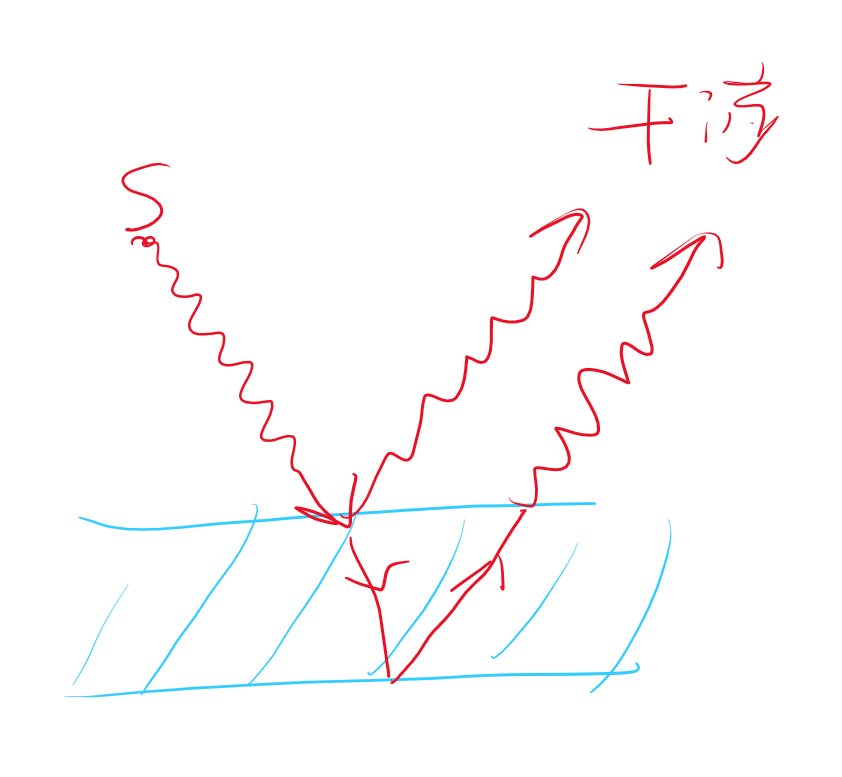

# 光学的构成  

- 几何光学 （光沿直线传播）
- 波动光学
  - 干涉
    - 杨氏干涉（*）
    - 薄膜干涉
      - 均匀（*）
      - 非均匀
        - 劈尖（*）
        - 牛顿环
  - 衍射
    - 单缝衍射（*）
    - 光栅衍射（*）
  - 偏振
- 物理光学

--- 

# 光源 光的相干性 

## 1 光源  

def：能够发射光波的物体统称为光波。

普通的光源中大量原子或者分子独自的发射各个波列。频率，相位，震动的方向几乎不可能同时相同，所以他们不会干涉。

Maxwell认为光也是电磁波：

## 2 单色光和光谱  

- 可见光的波长范围
  - $\lambda$:400~750nm

单色光： def：具有单一频率的光。

## 3 光的相干性

平面电磁波方程 
$$\begin{cases}
  E = E_0\cos\omega(t - \frac{r}{u})\\
  H = H_0\
\end{cases}$$

- 相干波需要满足
  - 频率相同
  - 震动方向相同
  - 相位差恒定 

## 4 获取相干光的方法  

### 4.1 分波阵面法  

### 4.2 分振幅法  

托马斯·杨：**“同出一源，一分为二”**

