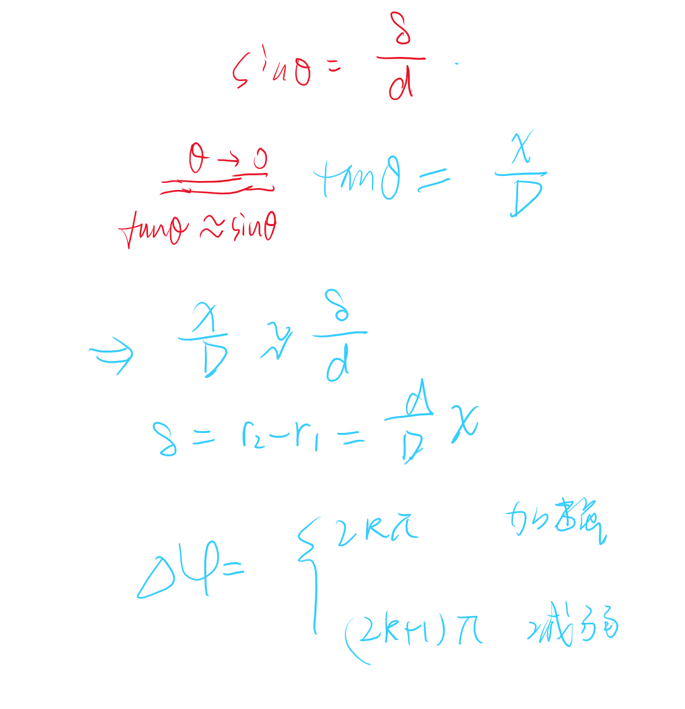

# 杨氏双缝干涉  

<!-- @import "[TOC]" {cmd="toc" depthFrom=1 depthTo=6 orderedList=false} -->

<!-- code_chunk_output -->

- [杨氏双缝干涉](#杨氏双缝干涉)
  - [1 杨氏双缝干涉实验](#1-杨氏双缝干涉实验)
    - [1.1 定量分析](#11-定量分析)
  - [2 菲涅尔双面镜实验](#2-菲涅尔双面镜实验)
  - [3 劳埃德镜实验](#3-劳埃德镜实验)

<!-- /code_chunk_output -->

---

## 1 杨氏双缝干涉实验 

-1.jpg>)

### 1.1 定量分析  

条纹间距：明或者暗条纹中心的距离
$$\Delta x = x_{k+1} - x_{k} = (k+1)\frac{D}{d}\lambda - k\frac{D}{d}\lambda$$

==记忆==

---

$$\Delta x = \frac{D}{d}\lambda$$

---

当我们适用白光照射的时候过渡区域产生彩色图谱。只有0级重点是白色

条纹中心的间距是均匀的。

## 2 菲涅尔双面镜实验  

两个虚光源重叠部分是干涉部分
（通过两个透镜对称产生两个虚光源。）

条纹间距

$$\Delta x = \frac{D}{d} \lambda$$

你发现这两个虚光源就是两个小孔，对应杨氏双缝干涉，因此菲涅尔双面镜可以等效为杨氏双缝

## 3 劳埃德镜实验 

同样的我们发现劳埃德镜实验也可以转化为杨氏双缝干涉实验，并且条纹间距公式依然成立。
$$\Delta x = \frac{D}{d}\lambda$$

值得注意的是，由于他是虚光源，所以条纹只有一半，并且本该出现明纹的地方变成了暗纹。
二者光强互补。
本质原因 ：**半波损失**导致相位颠倒。

