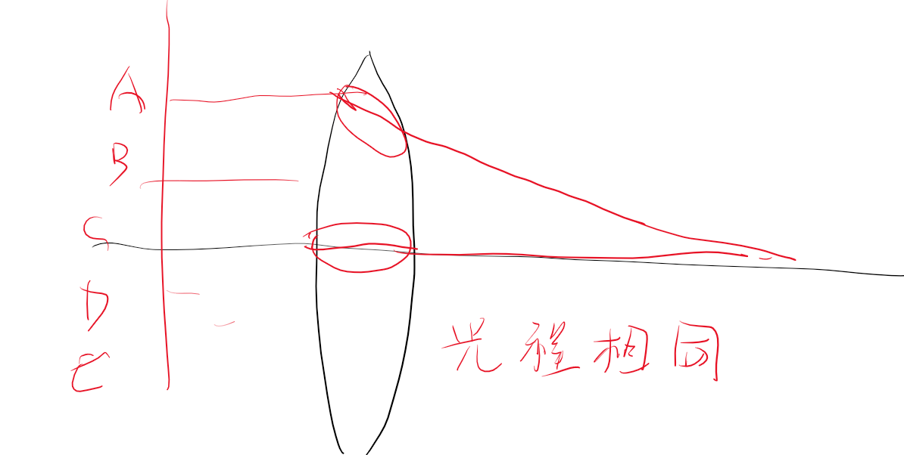

## 1 光程  

光的几何路程 
光程：
def：几何路程×折射率

## 2 光程差  

$$\delta = n_2r_2 - n_1r_1$$

可以用来计算相位差

$$\Delta\varphi = 2\pi \frac{\Delta}{\lambda}$$
$\Delta$表示光程差。
$$c=\lambda\nu $$
**不同介质中波长不同**
因此波长全部统一到真空中，
只不过我们求光程的时候需要乘上折射率。相当于把波映射到真空中去求了。

## 3 透镜不引起附加光程  

从波动光学解释

焦点最亮，说明光强最大，说明和振幅最大，因此ABCDE合成的时候同向，因此他们同向。

**同向的到明纹，反向得到暗纹**
**然后相位差可以通过光程差求解**
**光程可以适用几何距离×折射率**