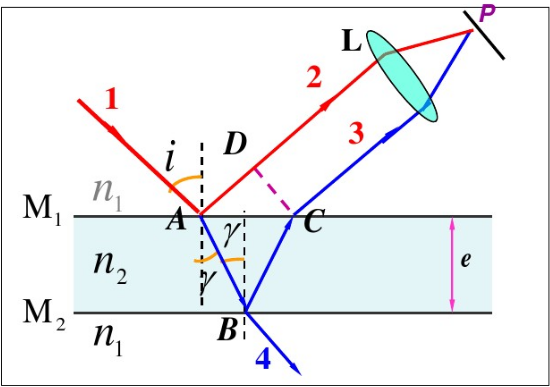
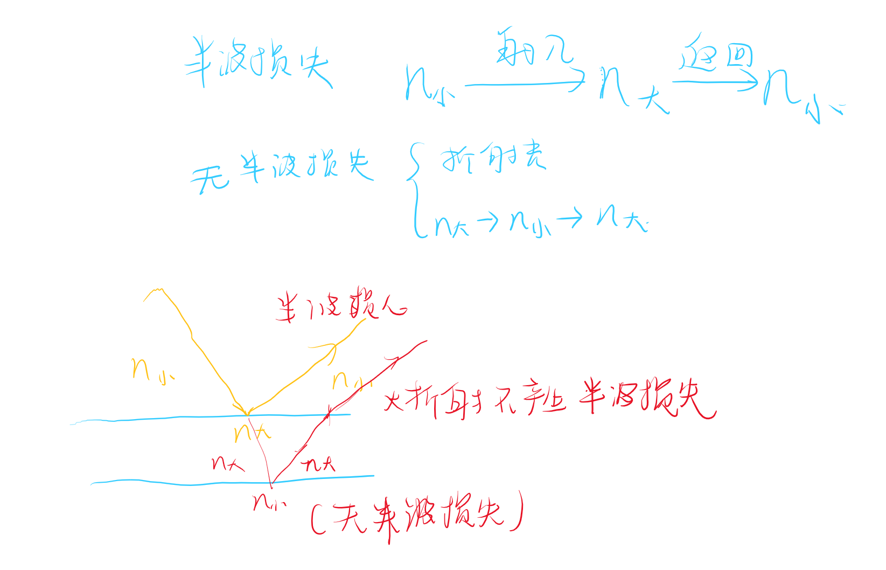

薄膜干涉
- 均匀薄膜
- 非均匀薄膜  

# 薄膜干涉  

<!-- @import "[TOC]" {cmd="toc" depthFrom=1 depthTo=6 orderedList=false} -->

<!-- code_chunk_output -->

- [薄膜干涉](#薄膜干涉)
  - [1 均匀薄膜干涉](#1-均匀薄膜干涉)
  - [:star:2 半波损失的判定](#star2-半波损失的判定)

<!-- /code_chunk_output -->

---

## 1 均匀薄膜干涉

薄膜干涉满足“同出一源，一分为二”

$$\Delta_r = n_2(AB+BC)-n_2(AD)+\frac{\lambda}{2}$$

其中$\frac{\lambda}{2}$是半波损失

## :star:2 半波损失的判定

**半波损失的条件**：

我们看到的干涉现象应该是一个圆环，这种倾角相同的干涉称为`等倾干涉`。

