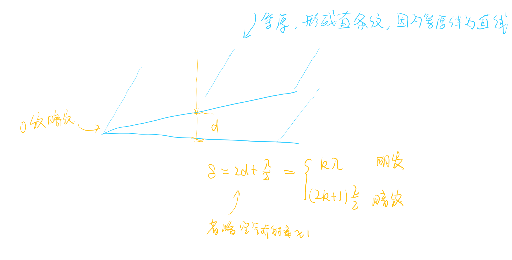
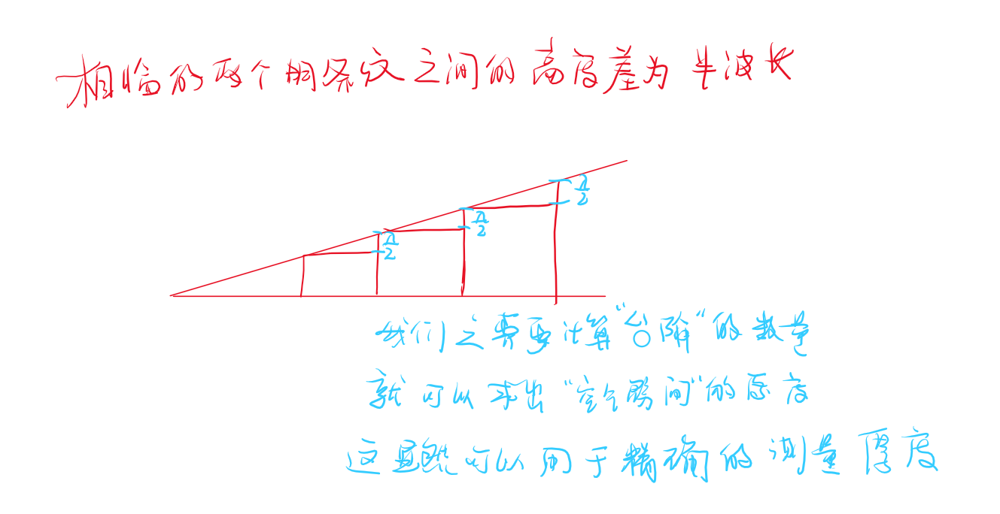
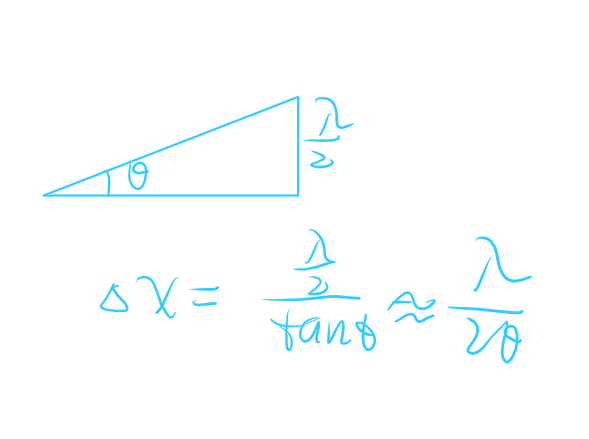
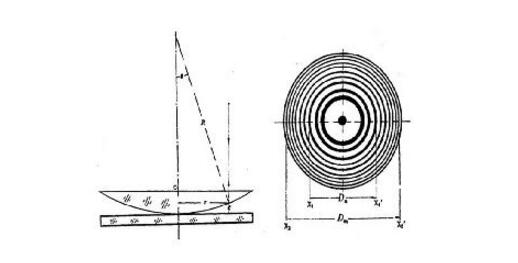
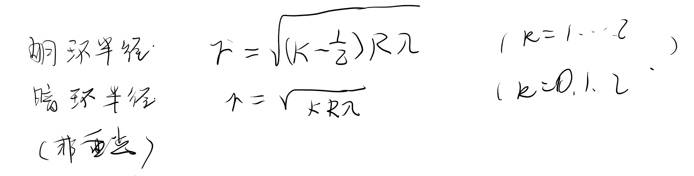

- 劈尖 
  - 介质劈尖
  - 空气劈尖

# 劈尖 & 牛顿环

<!-- @import "[TOC]" {cmd="toc" depthFrom=1 depthTo=6 orderedList=false} -->

<!-- code_chunk_output -->

- [劈尖 & 牛顿环](#劈尖--牛顿环)
  - [1 劈尖](#1-劈尖)
  - [2 空气劈尖的应用](#2-空气劈尖的应用)
  - [3 牛顿环](#3-牛顿环)
  - [4 牛顿环的应用](#4-牛顿环的应用)

<!-- /code_chunk_output -->

---

## 1 劈尖 

.jpg>)

我们观察到了明暗相间的等间距条纹。

两个玻璃板相接触的地方有一个暗条纹称为`0级暗纹`

**空气膜的上表面和下表面形成干涉**

因为其他的光线超过了相干长度。所以他们无法形成干涉。波列没有重合的机会。
例如玻璃过厚就会超过相干长度，因此其实只有在薄膜处才会产生干涉！
这也是为什么我们现实生活中的玻璃窗看不到条纹的原因。

$$\delta = 2d +\frac{\lambda}{2}$$

**等距原因的解释：**

**注意这里是空气劈尖**
介质劈尖需要对方程做修正
$$d_{k+1}-d_{k}=\frac{\lambda}{2n}$$

条纹间距 
我们根据高度差的`台阶`结论可以很容易的求得结论。

## 2 空气劈尖的应用  

1. 测量厚度
2. 检测一起表面的平整程度

## 3 牛顿环 

牛顿环的本质是一个不均匀的劈尖  

$$\delta = 2d + \frac{\lambda}{2}$$

## 4 牛顿环的应用

1. 检查工件
2. 测量曲率半径

