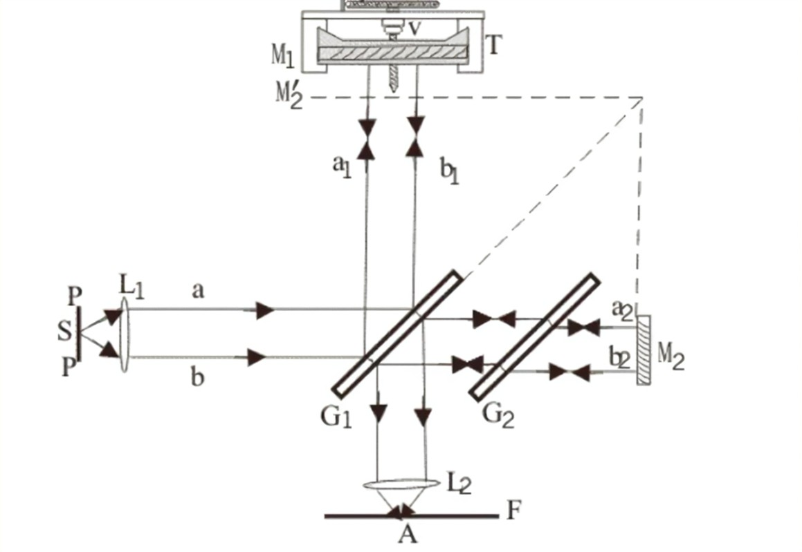
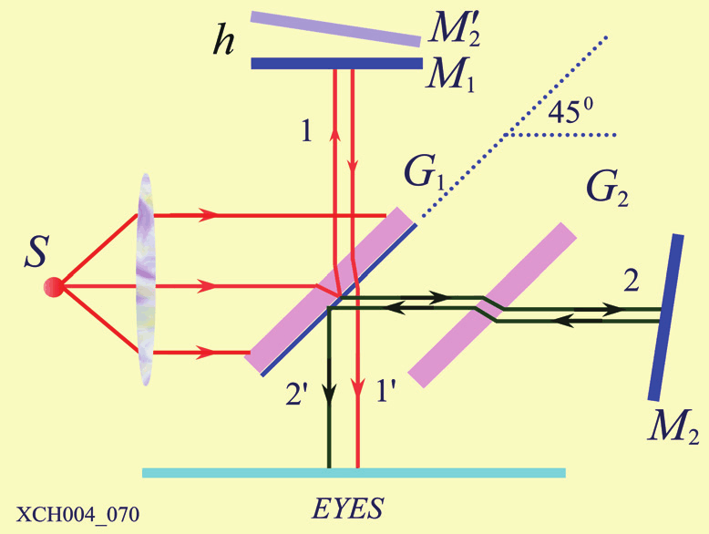
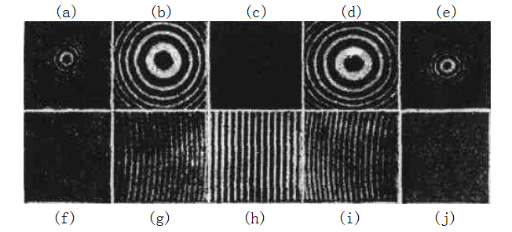
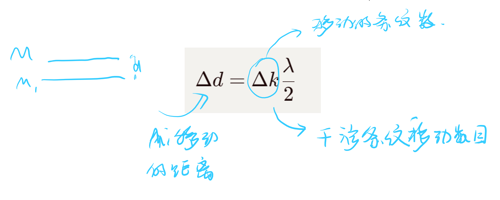

# 迈克耳孙干涉仪  

<!-- @import "[TOC]" {cmd="toc" depthFrom=1 depthTo=6 orderedList=false} -->

<!-- code_chunk_output -->

- [迈克耳孙干涉仪](#迈克耳孙干涉仪)
  - [1 迈克耳孙干涉仪](#1-迈克耳孙干涉仪)

<!-- /code_chunk_output -->

---

## 1 迈克耳孙干涉仪

[美国物理学第一个诺贝尔奖]

$M_2'$是虚相，$M_1,M_2'$构成一个劈尖，可以看到等倾干涉条纹。

**需要掌握的公式**
$$\Delta d = \Delta k\frac{\lambda}{2}$$

平面镜移动的距离，干涉条纹移动的书数目。

他显然可以测量波长

