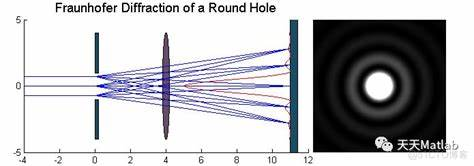
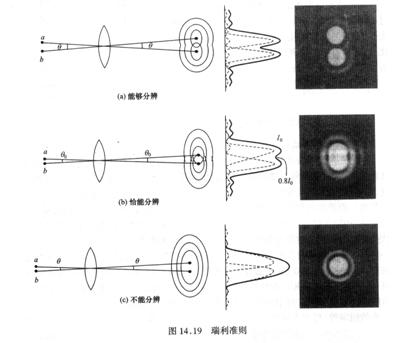

# 夫琅禾费的圆孔衍射

<!-- @import "[TOC]" {cmd="toc" depthFrom=1 depthTo=6 orderedList=false} -->

<!-- code_chunk_output -->

- [夫琅禾费的圆孔衍射](#夫琅禾费的圆孔衍射)
  - [1 夫琅禾费的圆孔衍射](#1-夫琅禾费的圆孔衍射)
  - [2 光学仪器的分辨本领](#2-光学仪器的分辨本领)

<!-- /code_chunk_output -->

## 1 夫琅禾费的圆孔衍射

## 2 光学仪器的分辨本领

我们定义最小可分辨角就是艾里斑的半角宽度
