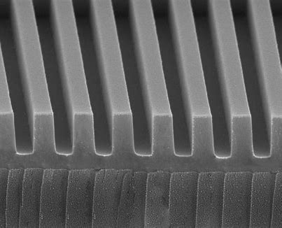
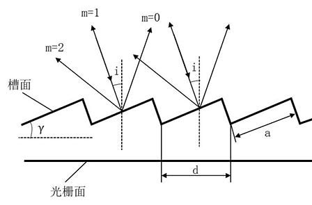
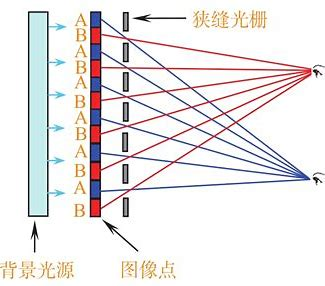
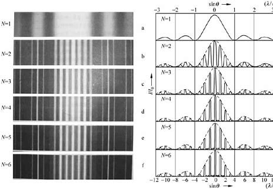
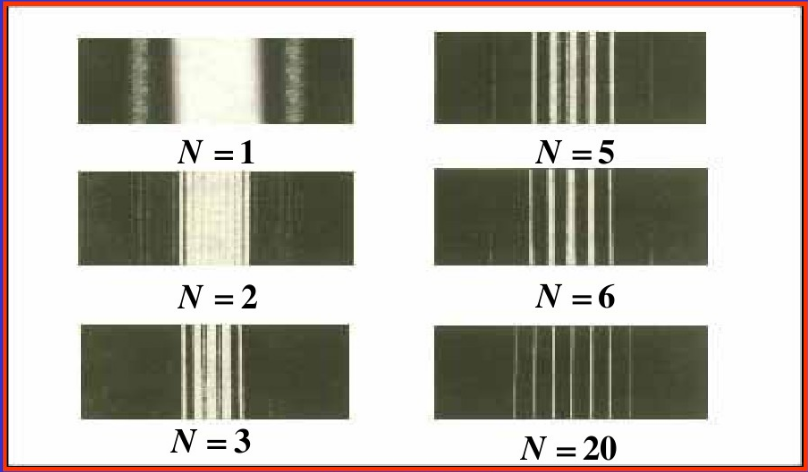
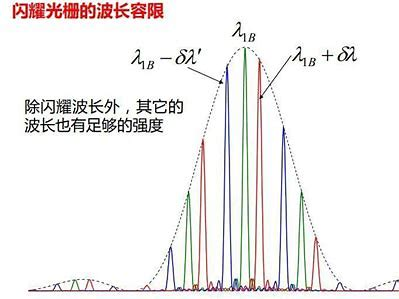

# 光栅

<!-- @import "[TOC]" {cmd="toc" depthFrom=1 depthTo=6 orderedList=false} -->

<!-- code_chunk_output -->

- [光栅](#光栅)
  - [1 光栅衍射](#1-光栅衍射)
    - [1.1 光栅衍射条纹的形成](#11-光栅衍射条纹的形成)
    - [:star:1.2 光栅衍射方程](#star12-光栅衍射方程)
    - [3 光栅的光强分布](#3-光栅的光强分布)
    - [4 衍射光谱类型](#4-衍射光谱类型)
    - [5 缺级条件](#5-缺级条件)

<!-- /code_chunk_output -->

## 1 光栅衍射 

1. 透射光栅
2. 反射光栅
3. 立体光栅

<!-- ### 1.1 光栅常数  -->

### 1.1 光栅衍射条纹的形成

光栅衍射条纹是 **衍射和干涉** 的总效果

### :star:1.2 光栅衍射方程

光栅方程：（明纹）
$$d\sin\theta = \pm k \lambda (k =1,2...)$$
==衍射角为$\theta$的相邻两缝对应光线的光程差==
**注意和单缝衍射的暗纹方程$a\sin\theta = \pm k\lambda$区分开**
$$\sin\theta_k = \pm \frac{k\lambda}{d} (k =0,1,2...)$$

相邻两主极大之间的次极大的数目= 光栅缝数 - 2 

次级大太多被背景光淹没

### 3 光栅的光强分布

由于理想情况我们只考虑每个缝之过去一个子波，但实际情况并不是那样。

缺极现象：同时满足当满足光栅方程主极大条件和单缝衍射的暗纹条件

### 4 衍射光谱类型

1. 连续光谱：炙热物体
2. 线状光谱：放电管中的气体
3. 带状光谱：分子光谱

### 5 缺级条件 

缺极现象：同时满足当满足光栅方程主极大条件和单缝衍射的暗纹条

$$\begin{cases}
    d\sin\theta = \pm k \lambda\\
    a\sin\theta = \pm k'\lambda
\end{cases}$$
