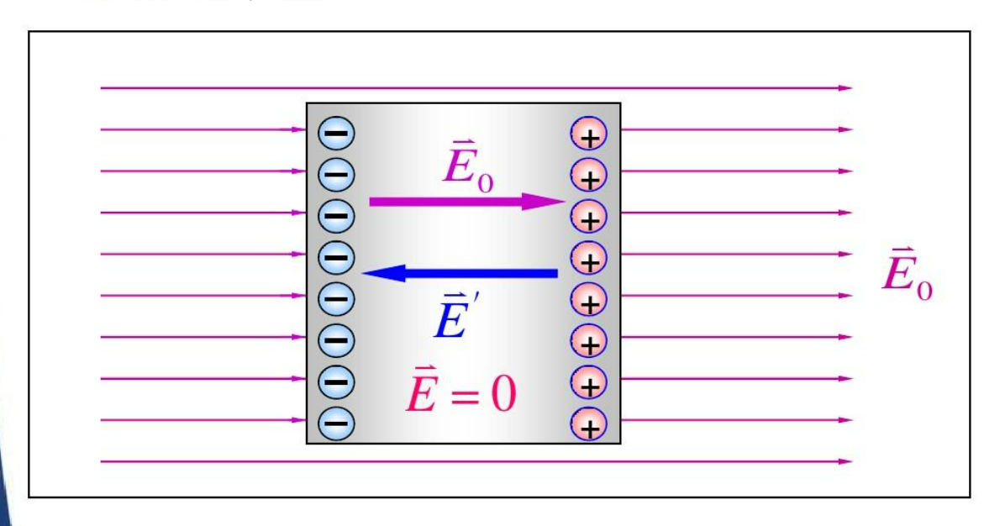
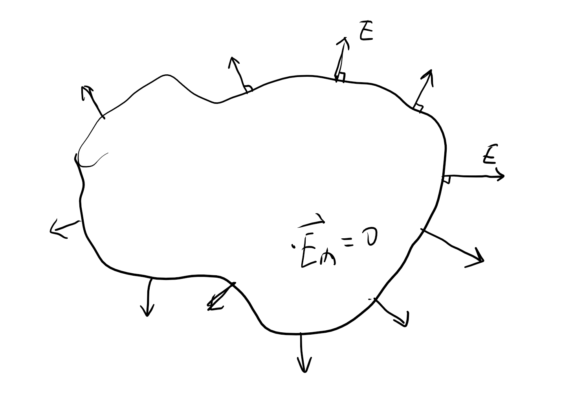
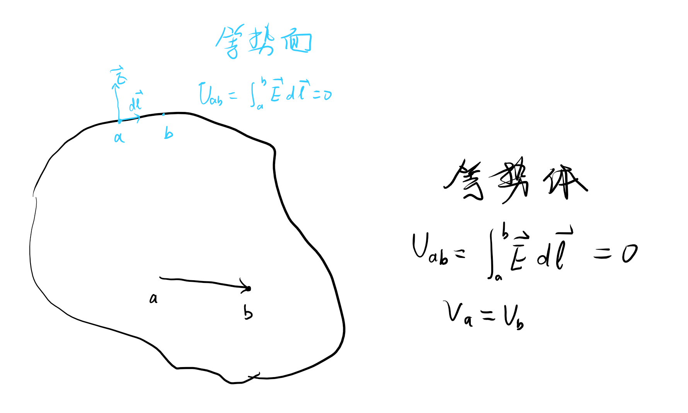
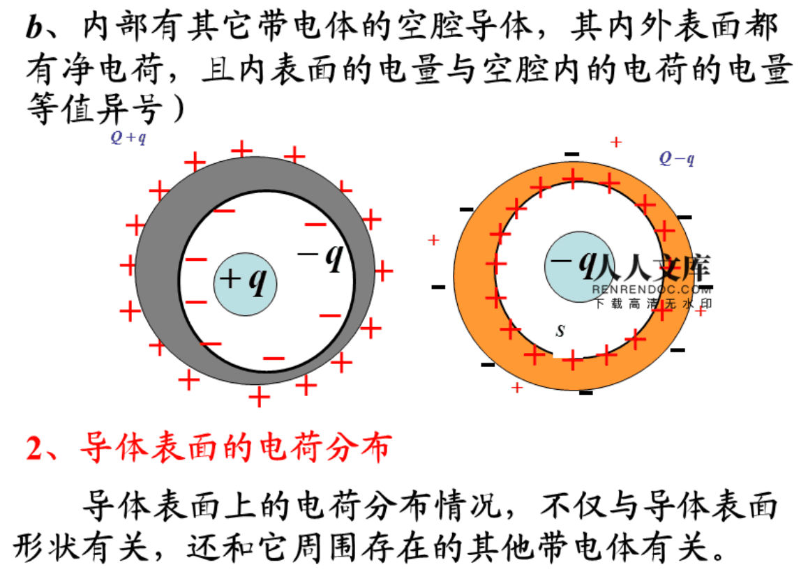
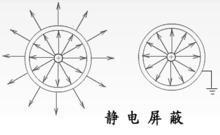

## 1 导体的静电平衡

导体处于静电场中，导体的内部和导体的表面没有电荷移动的状态处于静电平衡
内电场和外电场大小相同，方向相反。

1. 条件
   1. 导体内部任意场强为0（否则自由电子做运动）
   2. 导体表面附近任一点的场强方向必垂直与该导体表面

如果不垂直，则电场分解为垂直于表面和平行与表面的两个方向，其中平行与导体表面的分电场使电子移动，所以导体表面的电场必须垂直于表面。

2. 特点
   1. 整个导体是一个等势体，导体表面是等势面。
   2. 导体内部不存在**净电荷**（还是有电荷但是正负归0），电荷只能分布在导体的表面。
   3. 导体表面上的电荷分布一般来说是非均匀的，他与表面的形状以及外电场有关。**尖端放电**（越尖的部分电荷分布密度越大）。
   4. 导体表面附近的场强与电荷面密度成正比。$$\vec{E} = \frac{\sigma}{\varepsilon_0}\vec{e}_{n}$$

## 2 空腔导体

### 2-1 空腔内没有带电体

**由于高斯定理的要求**
空腔内场强处处为0，电势处处相等。

### 2-2 空腔内部有带电体 

**由于高斯定理的要求**

## 3 静电屏蔽 

1. 屏蔽外电场
2. 屏蔽内电场
