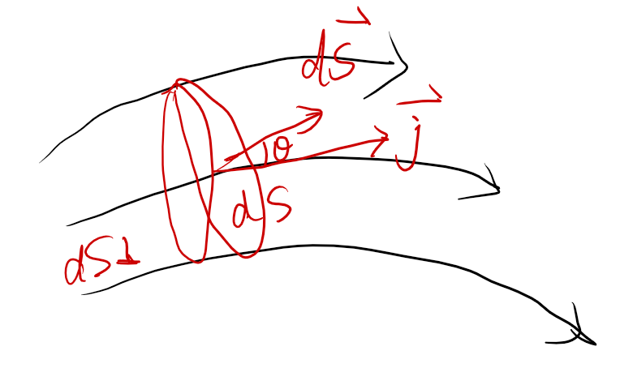

## 1 电流的定义

我们再导线中定义
$$i= \frac{dq}{dt}$$
这种定义只能使用在导线中具有局限性

我们

## 2 电流密度

$$\vec{j}= \frac{d\vec{I}}{dS_{\bot}}\vec{e_n}$$

**电流就是电流密度的通量**
$$\vec{I}= \oiint_S\vec{j}d\vec{S}$$

## 3 欧姆定律

$$\vec{j} = \frac{\vec{E}}{\rho} = \sigma\vec{E}$$
${\rho}$是导体的电阻率。$\sigma$是电导率。
