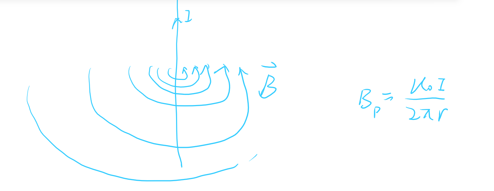
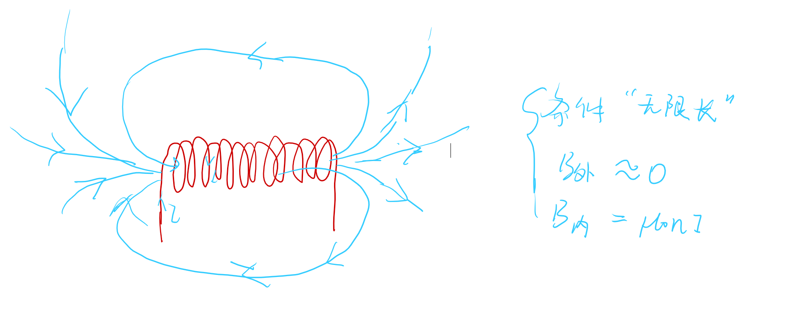

# 磁通量
- [磁通量](#磁通量)
  - [1 磁感应强度](#1-磁感应强度)
  - [2 磁通量](#2-磁通量)
  - [3 磁场的高斯定理](#3-磁场的高斯定理)
  - [4 一些常见的磁场](#4-一些常见的磁场)

## 1 磁感应强度

为了形象的描述场的分布，我们引入了磁感应线。

1. 强度：磁感应线的疏密程度$B = \frac{dN}{dS_{\bot}}$
2. 方向：磁感应线的切线方向

- 磁感应线的性质
  1. 不相交性
  2. 闭合性(无源场的无源性)

## 2 磁通量 

$$\varPhi = \vec{B}\cdot d\vec{S}$$

$$\varPhi = \iint_S\vec{B}\cdot d\vec{S}$$

## 3 磁场的高斯定理
$$\varPhi = \oiint_S\vec{B}\cdot d\vec{S}=0$$

>推论
$$\oiint_S\vec{B}\cdot d\vec{S}=0=\iiint_V\text{div}\vec{B}\cdot \vec{S}=0$$
因此无源场的散度恒为0

## 4 一些常见的磁场

