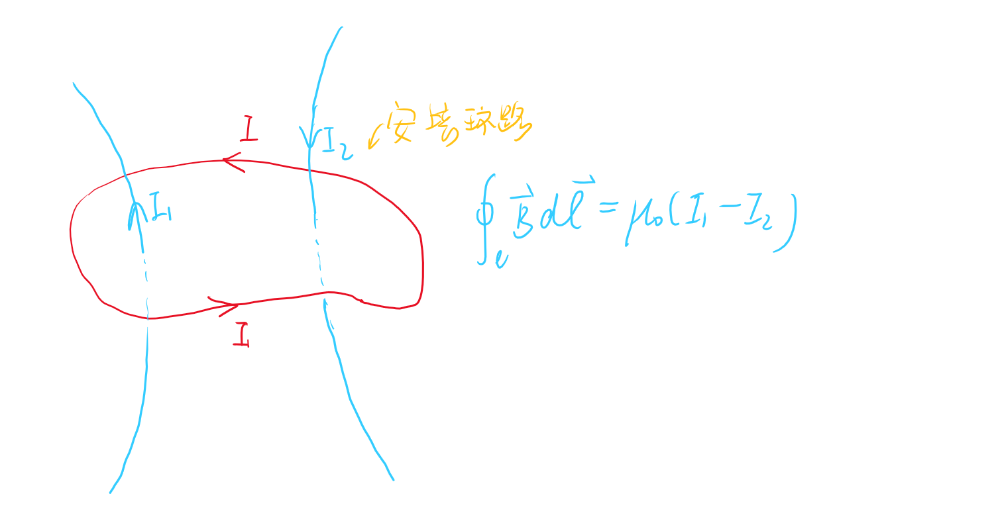
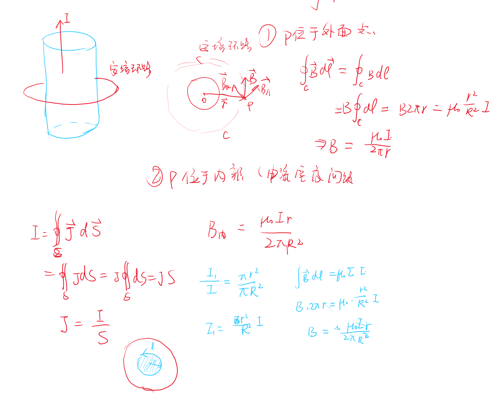

# 磁场的安培环路定理

<!-- @import "[TOC]" {cmd="toc" depthFrom=1 depthTo=6 orderedList=false} -->

<!-- code_chunk_output -->

- [磁场的安培环路定理](#磁场的安培环路定理)
  - [1 安培环路定理](#1-安培环路定理)
  - [2 安培环路定理求磁场分布](#2-安培环路定理求磁场分布)
  - [3 典型的磁场分布](#3-典型的磁场分布)

<!-- /code_chunk_output -->

---

## 1 安培环路定理  

$$\oint_l \vec{B}d\vec{l} = \mu_0 \Sigma \pm I_{内}$$

$\pm I_{内}$是穿过安培环路的电流的代数和
1. 穿过环路
2. 代数和（I与环路构成右手螺旋关系则为正，否则为负）

## 2 安培环路定理求磁场分布  

由于闭合曲线积分的方向性问题，这很显然限制了安培环路定理使用。
和高斯定理类似，具有柱对称性的磁场可以用安培环路定理求出。  

## 3 典型的磁场分布

