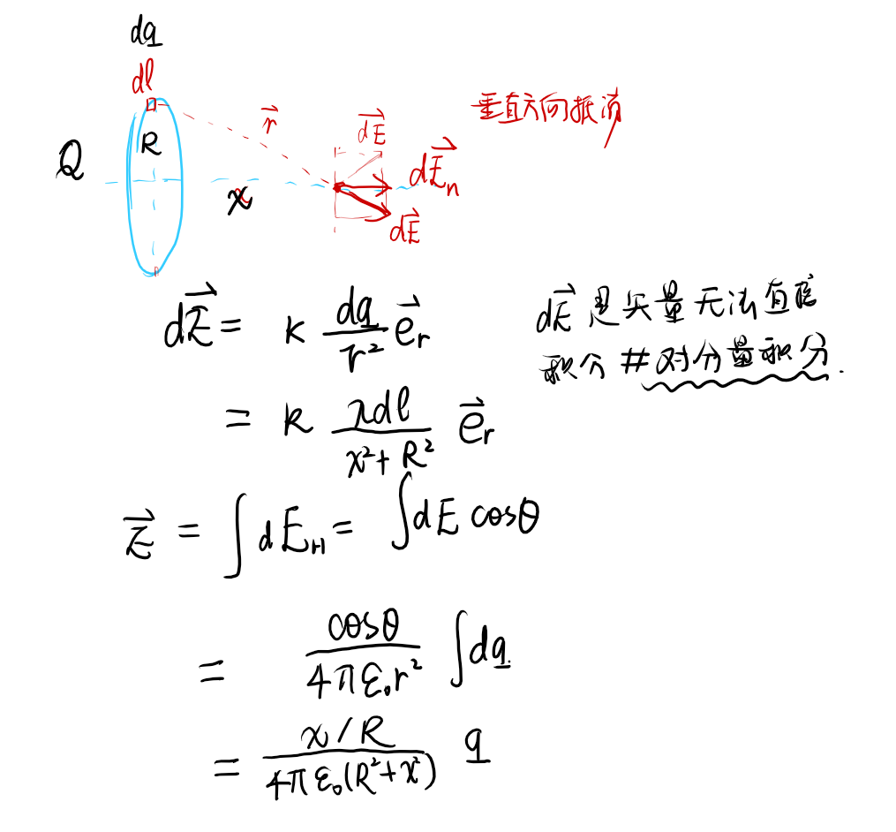
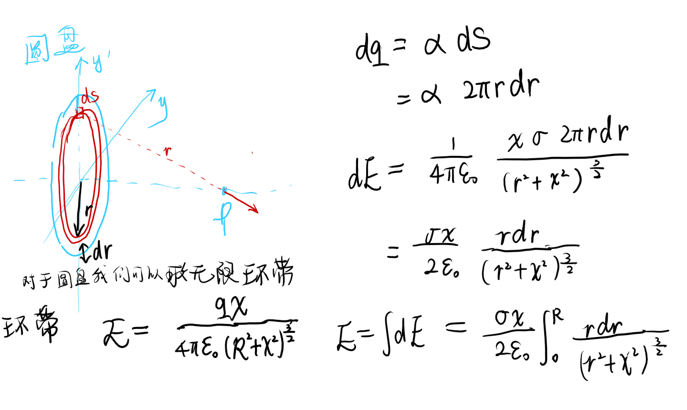

## 电场强度

### 定义
$$\vec{{E}} = \frac{\vec{F}}{q_0}$$
我们根据实验得出的结论，点电荷模型（1尺寸小，2带电量足够小_否则电场畸变）
**场强的方向就是正的点电荷受力方向**

### 场强的叠加原理  

根据电场力的叠加原理我们得出了场强的叠加原理

电场力叠加原理：$$\vec{F} = \vec{F}_1+\vec{F}_2 + \vec{F}_3+...+\vec{F}_n$$

场强叠加原理：$$\frac{\vec{F}}{q_0} = \frac{\vec{F_1}}{q_0}+\frac{\vec{F_2}}{q_0} + \frac{\vec{F_3}}{q_0}+...+\frac{\vec{F_n}}{q_0}$$
故场强的叠加公式为：
$$\vec{E} = \vec{E}_1 + \vec{E}_2 + \vec{E}_3 +...+ \vec{E}_n$$

### 使用叠加原理计算场强  

$$\vec{E} = \frac{1}{4\pi\varepsilon_0}\frac{Q}{r^2}\vec{e_r}$$

例题：

### 电荷连续分布的场强
$$d\vec{E} = \frac{1}{4\pi\varepsilon_0}\frac{dq}{r^2}\vec{e_r}$$

- 电荷体密度
- 电荷面密度
- 电荷线密度
  

例题：

