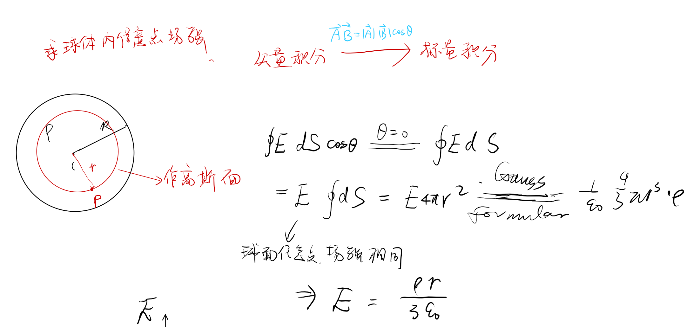
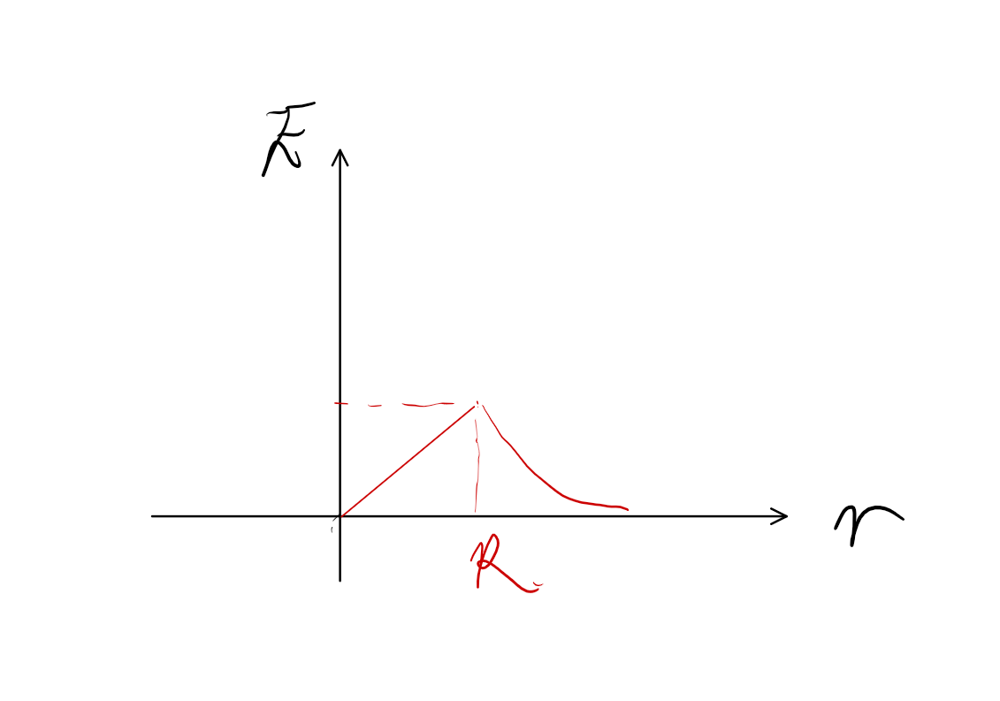
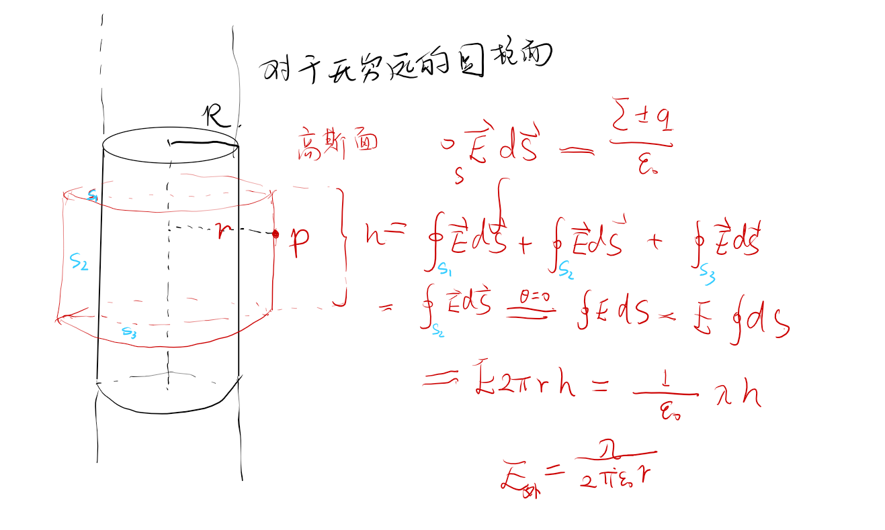

## 复习

$$\oint\overrightarrow{E}d\overrightarrow{S}=\frac{\sum\pm q}{\varepsilon_{0}}=\frac{q_{1}-q_{2}}{\varepsilon_{0}}$$

- 适合高斯定理的情况
  - 球对称性
  - 柱对称性
  - 面对称型

**带电球面**内任意一点，场强为0。
均匀带电球面/球体外面一点的场强等于点电荷的场强。

对于圆柱体
$$E=\begin{cases}
  \frac{\rho R^2}{2\varepsilon_0 r},r>R\\
  \ \\
  \frac{\rho R}{2\varepsilon_0},r<R
\end{cases}$$

