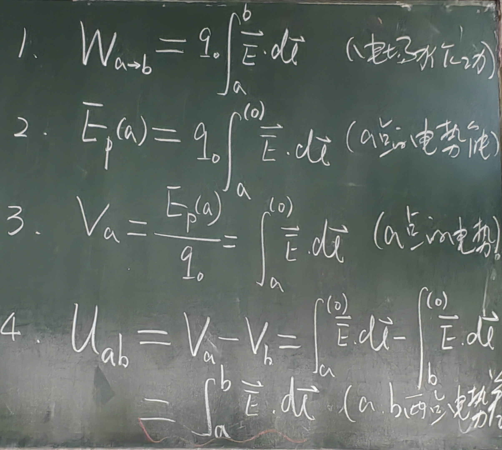

## 电势能  

电场力做功$$W_{ab}=q_0\int_{a}^{b}\vec{E}\cdot d\vec{l}$$
电势能的差值就是电场力做的功。
势能只有相对的概念，因此经常需要规定一个电势能的零点。我们通常选择离场源电荷的无穷远点为零点。场源电荷需要时有界的，即无穷远处没有电荷。

## 电势  
$$V_A = \frac{E_{ab}}{q_0} = \int
_{a}^{\infty}\vec{E}\cdot d\vec{l}$$
令q_0=1,即单位正电荷从一点积分到另一点。
- 电势零点选取
  - 场源电荷有界 无穷远处
  - 无界 除了无穷远处的任一点

## 电势差  
$$U_{ab} = V_a-V_b = \int
_{a}^{\infty}\vec{E}\cdot d\vec{l}-\int
_{b}^{\infty}\vec{E}\cdot d\vec{l}=\int
_{a}^{b}\vec{E}\cdot d\vec{l}$$

