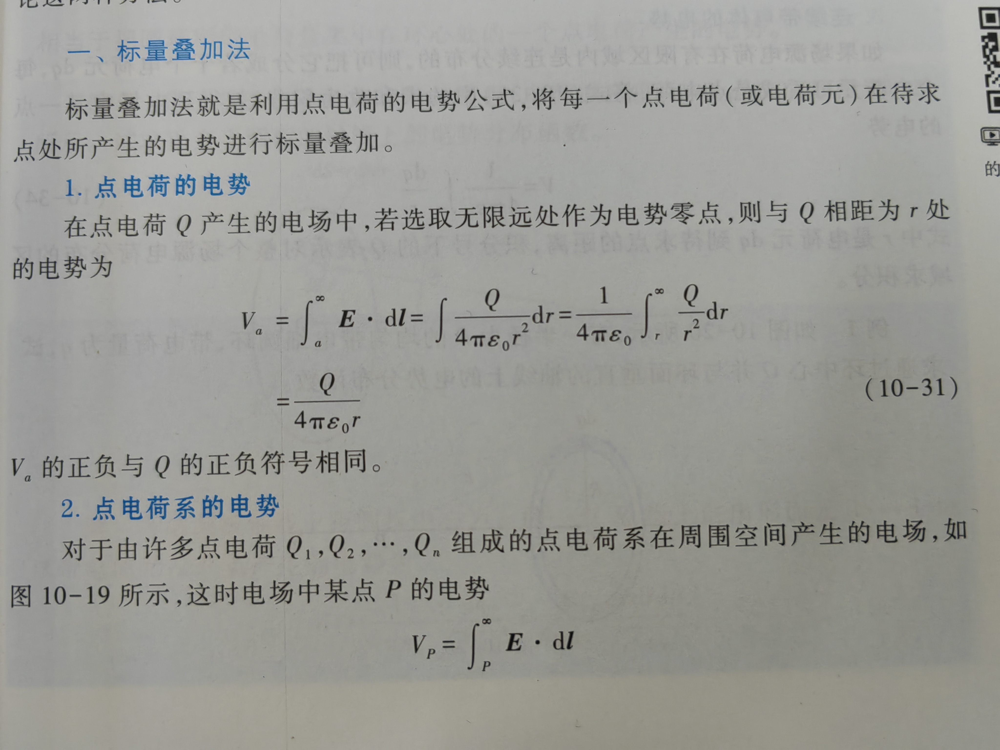
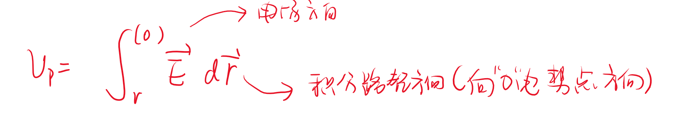
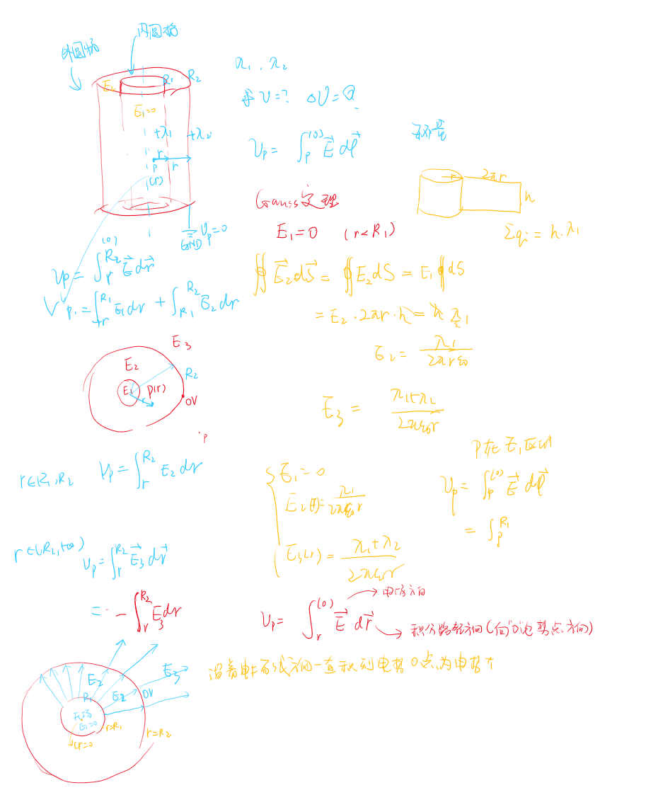

- 计算方法
    - 标量叠加

## 标量叠加法
**着重注意方向性问题，以及0电势点的问题**
{场强往往使用矢量叠加法}
按照以下步骤

### 1.点电荷的电势公式
在点电荷 $\text{Q}$ 产生的电场中,若选取无限远处作为电势零点，则与$Q$相距为$r$的电势为
$$dV_p = \frac{1}{4\pi \varepsilon_0}\frac{dq}{r}$$

$$\begin{aligned}
V_{a}& =\int_{a}^{\infty}\vec{E}\cdot\mathrm{d}\vec{l}=\int\frac{Q}{4\pi\varepsilon_{0}r^{2}}\mathrm{d}r=\frac{1}{4\pi\varepsilon_{0}}\int_{r}^{\infty}\frac{Q}{r^{2}}\mathrm{d}r  \\
&=\frac{Q}{4\pi\varepsilon_{0}r}
\end{aligned}$$

**电势为0的点，场强不一定为0**
**场强为0的点，电势不一定为0**
### 2.点电荷系的电势公式

标量叠加

### 3 例题  

**我们需要着重注意电势的方向**

